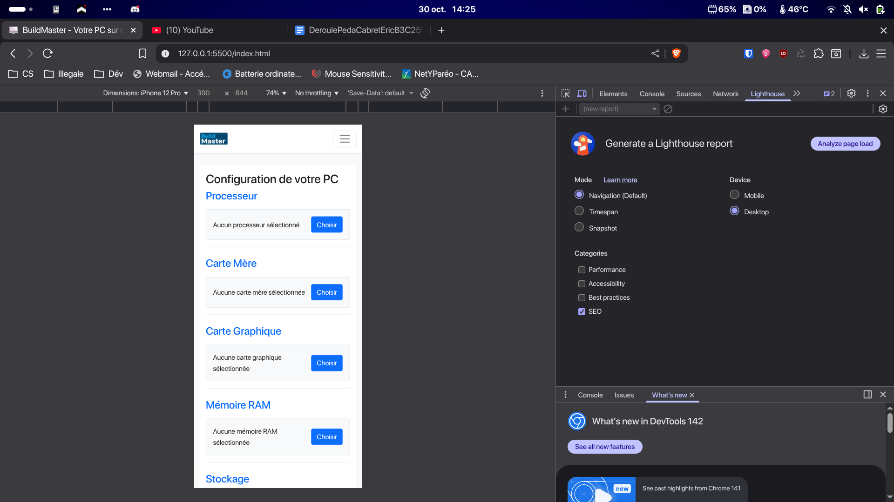

# BuildMaster - Configurateur de PC sur mesure

Ce projet est une interface web statique pour "BuildMaster", un service permettant aux utilisateurs de configurer leur propre ordinateur PC sur mesure. L'interface a été conçue sans framework JavaScript, en utilisant uniquement du HTML5, du CSS3 et du JavaScript natif, avec l'aide de la bibliothèque Bootstrap pour la structure et le design responsive.

## Table des matières

- [Aperçu du projet](#aperçu-du-projet)
- [Choix Techniques](#choix-techniques)
  - [HTML5 Sémantique](#html5-sémantique)
  - [CSS3 Moderne](#css3-moderne)
  - [JavaScript Natif (Vanilla JS)](#javascript-natif-vanilla-js)
  - [Framework CSS : Bootstrap 5](#framework-css--bootstrap-5)
- [Structure des fichiers](#structure-des-fichiers)
- [Comment lancer le projet](#comment-lancer-le-projet)
- [Livrables](#livrables)
  - [Livrable 1 : Captures d'écran (Responsive Design)](#livrable-1--captures-décran-responsive-design)
  - [Livrable 2 : Rapport d'analyse accessibilité](#livrable-2--rapport-danalyse-accessibilité)
  - [Livrable 3 : Rapport de structuration HTML](#livrable-3--rapport-de-structuration-html)

---

## Aperçu du projet

Le site se compose de deux pages principales :
1.  **Accueil (`index.html`)** : La page centrale où les utilisateurs peuvent sélectionner les composants pour leur PC (processeur, carte mère, etc.). Elle inclut un récapitulatif de la configuration qui se met à jour en temps réel (fonctionnalité à implémenter) et un total du prix.
2.  **À propos de nous (`valeurs.html`)** : Une page présentant les valeurs de l'entreprise et l'équipe.

Une modale unique gère l'inscription et la connexion, avec une transition fluide entre les deux formulaires.

## Choix Techniques

Conformément à la consigne, le projet a été développé en utilisant les technologies web fondamentales, sans framework JavaScript.

### HTML5 Sémantique

L'utilisation de balises sémantiques HTML5 a été une priorité pour améliorer l'accessibilité et le SEO.

-   **Structure claire** : Les balises `<header>`, `<nav>`, `<main>`, `<section>`, `<aside>`, et `<footer>` sont utilisées pour délimiter clairement les différentes parties de la page.
-   **Accessibilité** : Des attributs ARIA (`aria-labelledby`, `aria-controls`, `aria-label`, etc.) sont utilisés pour rendre la navigation et les composants interactifs plus accessibles aux lecteurs d'écran. Par exemple, chaque section de composant est liée à son titre via `aria-labelledby`.
-   **Hiérarchie des titres** : Les titres (`<h1>` à `<h3>`) sont utilisés de manière logique pour structurer le contenu et faciliter la compréhension de la page.

### CSS3 Moderne

Le style est géré via une feuille de style personnalisée (`css/style.css`) qui s'appuie sur Bootstrap.

-   **Variables CSS (Custom Properties)** : Le fichier `style.css` définit une palette de couleurs et des unités de base dans `:root`. Cette approche permet une maintenance simplifiée et la possibilité de thématiser facilement le site.
-   **Responsive Design** : Bien que Bootstrap fournisse la grille responsive, des styles personnalisés ont été ajoutés pour affiner l'affichage sur différentes tailles d'écran, notamment pour la section "Notre équipe" et les icônes de valeurs.
-   **Flexbox** : Utilisé abondamment (via les classes de Bootstrap `d-flex`, `justify-content-*`, etc.) pour aligner et distribuer les éléments de manière flexible et prévisible.
-   **Effets et Transitions** : Des transitions CSS sont utilisées pour des micro-interactions, comme l'animation de glissement entre les formulaires de connexion et d'inscription dans la modale.
-   **`position: sticky`** : L'encart récapitulatif sur la page de configuration utilise cette propriété pour rester visible lors du défilement, améliorant ainsi l'expérience utilisateur.

### JavaScript Natif (Vanilla JS)

Aucun framework ou bibliothèque externe (comme jQuery, React, etc.) n'a été utilisé pour la logique applicative, afin de garantir des performances optimales et de respecter la consigne.

-   **Manipulation du DOM** : Le script `js/main.js` utilise des méthodes natives comme `document.querySelector()` et `element.addEventListener()` pour cibler les éléments et réagir aux actions de l'utilisateur.
-   **Gestion des classes** : La logique de la modale (alternance entre inscription et connexion) est gérée en ajoutant ou en retirant dynamiquement la classe `.show-login` sur un conteneur parent, ce qui déclenche une transition CSS.
-   **Code non bloquant** : Le script est chargé avec l'attribut `defer` dans le HTML, garantissant que le rendu de la page n'est pas bloqué par le chargement du JavaScript.

### Framework CSS : Bootstrap 5

Bootstrap a été choisi comme base pour accélérer le développement de l'interface.

-   **Grille responsive** : Le système de grille de Bootstrap (`container`, `row`, `col-*`) est le pilier de la mise en page responsive du site.
-   **Composants pré-stylés** : Des composants comme la `navbar`, les `modal`, les `button` et les `form` ont été utilisés pour construire rapidement une interface fonctionnelle et esthétique.
-   **Classes utilitaires** : Les classes utilitaires (ex: `p-3`, `m-4`, `fw-bold`, `text-center`) ont permis de prototyper et d'ajuster le style rapidement sans avoir à écrire de CSS personnalisé pour chaque petit ajustement.

## Structure des fichiers

```
/
├── index.html
├── valeurs.html
├── readme.md
├── assets/
│   ├── icons/
│   └── img/
├── css/
│   ├── bootstrap/
│   └── style.css
└── js/
    └── main.js
```

## Comment lancer le projet

Le projet étant constitué de fichiers statiques, aucune installation n'est requise.
1.  Clonez ou téléchargez ce dépôt.
2.  Ouvrez le fichier `index.html` dans votre navigateur web.

---

## Livrables

### Livrable 1 : Captures d'écran (Responsive Design)

Les captures d'écran ci-dessous montrent l'aspect du site sur différentes tailles d'appareils.

**Vue Desktop**


**Vue Tablette**


**Vue Mobile**


### Livrable 2 : Rapport d'analyse accessibilité

Un rapport d'accessibilité a été généré à l'aide de l'outil Lighthouse. Il analyse les contrastes, les attributs ARIA, la navigation au clavier et d'autres critères essentiels.

[➡️ **Consulter le rapport d'accessibilité détaillé (HTML)**](https://github.com/Val0ry/fil_rouge/blob/main/reports/report-accessibility.html)

### Livrable 3 : Rapport de structuration HTML

Un rapport sur les bonnes pratiques et la structure sémantique du document a également été généré via Lighthouse. Il valide l'utilisation correcte des balises HTML5 et la structure globale du DOM.

➡️ **Consulter le rapport de structuration HTML détaillé (HTML)**